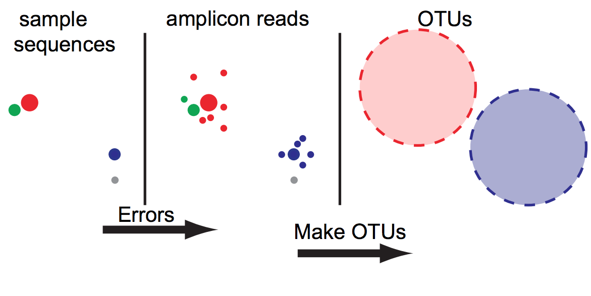
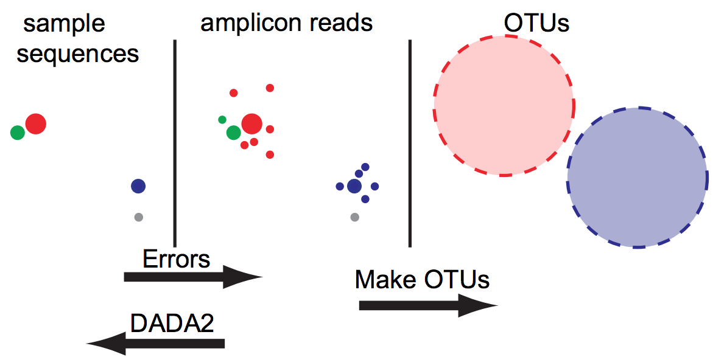
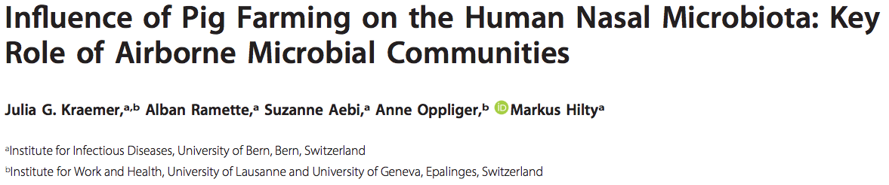

class: spaced 

```{r setup,include=FALSE}
knitr::opts_chunk$set(dev="CairoPNG",results="hold",fig.show="hold",fig.align="left",echo=FALSE,warning=FALSE,message=FALSE)

# report related
library(knitr)
library(markdown)
library(rmarkdown)
```

```{r,echo=FALSE,message=FALSE,warning=FALSE}
# load the packages you need

library(tidyverse)
library(ggplot2) # static graphics
```

## Amplicon sequencing
* Amplify region of interesting using PCR
* Sequence amplicons using HTS techniques (e.g. Illumina)
* Typically used for 16S, 18S and ITS genes
  * Well conserved (present in most organisms)
  * Contains variable regions (enough diversity)
---
name: report

## OTU clustering
### Operational Taxonomic Units
```{r, out.width="400px"}

```
*[Callahan et al Nat Methods. 2016](https://www.nature.com/articles/nmeth.3869)*

* Amplicon sequencing generates **a lot** of sequences
* Many of these are the result of sequencing errors (<span style="color:red">over-prediction</span>)
* OTU clustering has been used as a way to minimize the effect of errors by clustering similar sequences into __O__perational __T__axonomic __U__nits

---
name: report

## DADA2 
### Divisive Amplicon Denoising Algorithm 2
```{r, out.width="400px"}

```
*[Callahan et al Nat Methods. 2016](https://www.nature.com/articles/nmeth.3869)*

* Infers the rate $\lambda_{ji}$ at which a sequence $i$ is produced from a sequence $j$ based on nucleotide composition **and quality**
* Calculates *abundance p-values* $p_A$: a low $p_A$ indicates there are more reads of $i$ than can be explained by sequencing errors
* Iteratively divides sequences into partitions by comparing unique sequences to the most abundant sequence
* Stops when all sequences are in a partition most likely to have created them

---
name: report

## DADA2 
### Divisive Amplicon Denoising Algorithm 2
```{r, out.width="400px"}

```
*[Callahan et al Nat Methods. 2016](https://www.nature.com/articles/nmeth.3869)*

* Infers the rate $\lambda_{ji}$ at which a sequence $i$ is produced from a sequence $j$ based on nucleotide composition **and quality** (<span style="color:red">requires pair-wise alignments</span>)
* Calculates *abundance p-values* $p_A$: a low $p_A$ indicates there are more reads of $i$ than can be explained by sequencing errors (<span style="color:red">will not infer singletons</span>)
* Iteratively divides sequences into partitions by comparing unique sequences to the most abundant sequence (<span style="color:red">user-settable p-value threshold</span>)
* Stops when all sequences are in a partition most likely to have created them

---
name: report

## DADA2 
### Divisive Amplicon Denoising Algorithm 2


*[Callahan et al Nat Methods. 2016](https://www.nature.com/articles/nmeth.3869)*

DADA2 is able to infer sequences with higher similarity to other sequences compared to OTU clustering methods: **higher resolution**

---
name: report

## Amplicon Sequence Variants
### What are they good for?
"Exact sequence variants should replace operational taxonomic units in marker-gene data analysis" [Callahan et al 2017, ISMEJ](https://www.nature.com/articles/ismej2017119)
* consistent labels
  - Computational tractability
  - Meta-analysis
  - Replication
  - Forward prediction
* reference independence
  - Diversity measurement
  - Application across environments and genetic loci
  - Guaranteed observation
  - Changing references

---
name: report

## Software

* [DADA2](https://benjjneb.github.io/dada2/): "Amplicon Sequence Variants"
* [UNOISE3](https://www.drive5.com/usearch/manual/cmd_unoise3.html): "zero-radius OTUS"
* [MED](http://merenlab.org/software/med/): "MED nodes"
* [DEBLUR](https://github.com/biocore/deblur): "sub-OTUs"
---
name: report


## Workshop
### Data
[](http://aem.asm.org/content/early/2018/01/08/AEM.02470-17.short?rss=1)
* Studied microbiota in pigs, pig farmers and controls.
* Used DADA2 to process amplicon sequences

The workshop can be accessed [here](https://johnne.github.io/raukr_dada2/DADA2_workshop.html).
---
name: report

## Session  

* This presentation was created in RStudio using [`remarkjs`](https://github.com/gnab/remark) framework through R package [`xaringan`](https://github.com/yihui/xaringan).
* For R Markdown, see <http://rmarkdown.rstudio.com>
* For R Markdown presentations, see <https://rmarkdown.rstudio.com/lesson-11.html>

```{r,echo=TRUE}
R.version
```

---
name: end-slide
class: end-slide

# Thank you